# Image Processing with MATLAB 🖼️🔬

A collection of MATLAB scripts covering fundamental image processing techniques including brightness manipulation, contrast stretching, and histogram equalization — with full visual analysis of transformations and histograms.

<div align="center">
  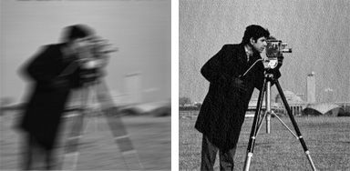
</div>

<br>
<div align="center">
  <a href="https://codeload.github.com/TendoPain18/image-processing-matlab/legacy.zip/main">
    
  </a>
</div>

## 📋 Description

This project implements core image processing operations from first principles in MATLAB, working with grayscale images. Each script explores a different technique — manual pixel-level brightness adjustment, contrast stretching via intensity mapping, and histogram equalization — visualizing both the processed images and their underlying intensity transforms and histograms.

---

## 🔬 Script 1 — Brightness Point Processing (Manual)
**File:** `brightness_point_processing_manual.m`

Manually iterates over every pixel of a grayscale image and applies a brightness shift by adding or subtracting a constant factor, clamping values to the valid `[0, 255]` range.

**Operations:**
- `bright_factor = +50` → brightens each pixel
- `dark_factor = -50` → darkens each pixel
- Manual triple nested loop (no built-in functions)

**Image Comparison:**

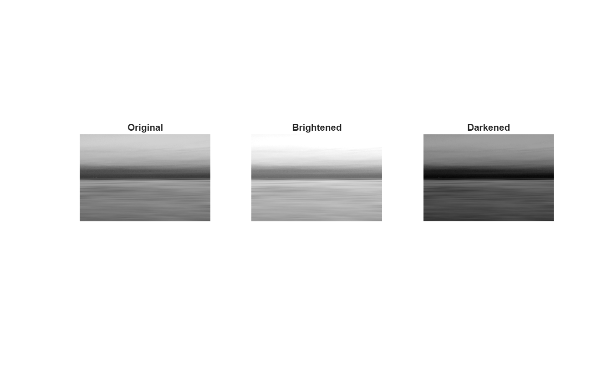

*Original, Brightened (+50), and Darkened (-50)*

**Histograms:**

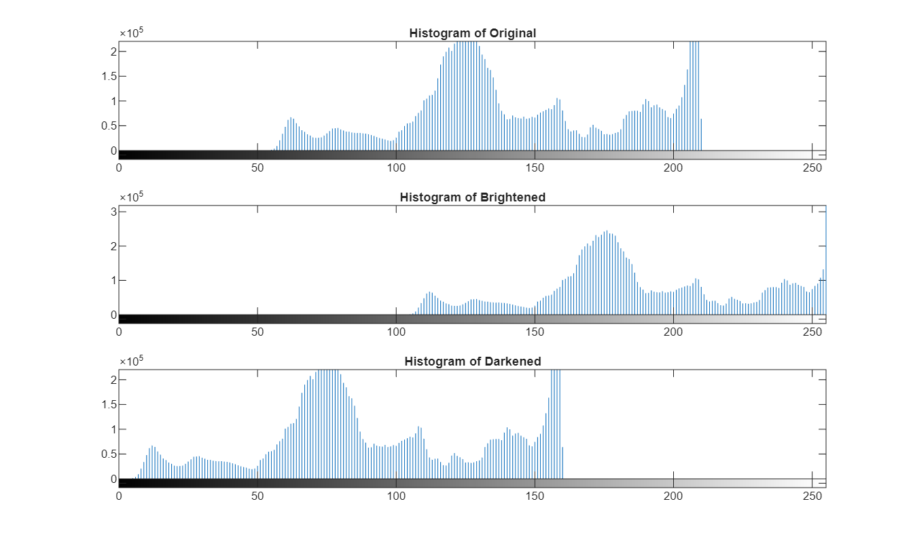

*Histograms showing the intensity distribution shift for each image*

**Output Transforms:**

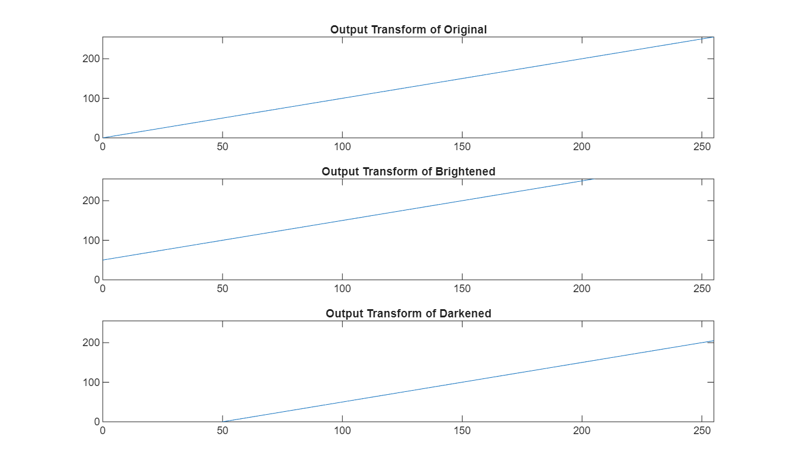

*Linear output transforms: identity, shifted up by 50, shifted down by 50*

---

## 🔬 Script 2 — Contrast Stretching & Intensity Adjustment
**File:** `contrast_stretching_intensity_adjustment.m`

Uses `imadjust` and `stretchlim` to stretch the intensity range of the cameraman image, clipping the bottom and top 1% of pixel values to maximize the dynamic range.

**Operations:**
- `stretchlim(img, [0.01, 0.99])` → finds the 1st and 99th percentile intensity values
- `imadjust` → maps the clipped range to the full `[0, 255]` scale
- Reports the resulting dynamic range

**Before & After:**

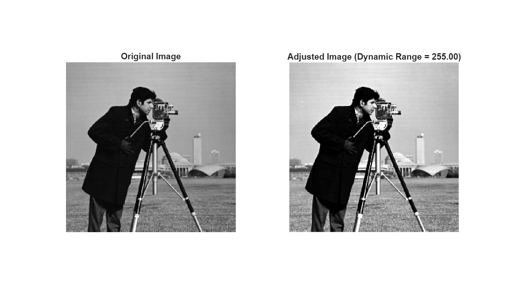

*Original image vs contrast-stretched image with dynamic range value*

---

## 🔬 Script 3 — Histogram Equalization & CDF Analysis
**File:** `histogram_equalization_cdf_analysis.m`

Manually computes the CDF from the image histogram and derives the output intensity transform. Applies `histeq` and visualizes how the transform changes before and after equalization.

**Operations:**
- Computes histogram and normalized CDF manually
- Derives output transform: `y = round(255 × CDF(x))`
- Applies `histeq` and recomputes CDF on equalized image
- Compares both transforms in a single figure

**Output Transform Comparison:**

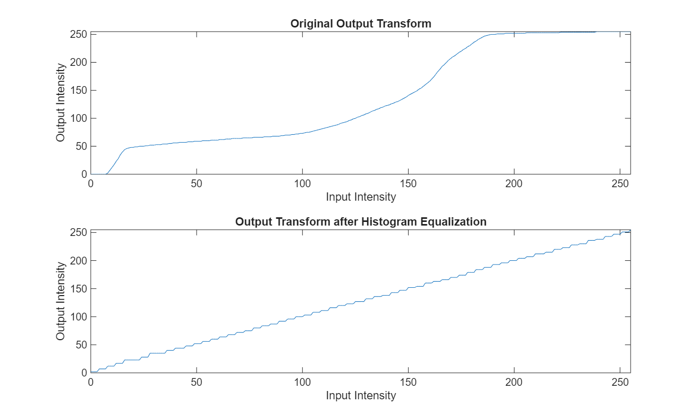

*Top: Original output transform (non-linear CDF curve). Bottom: After equalization (approximates a linear diagonal — ideal uniform distribution)*

**Equalized Image:**

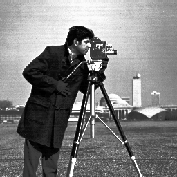

*Histogram-equalized cameraman image with enhanced contrast*

---

## 🔬 Script 4 — Histogram Equalization Visualization
**File:** `histogram_equalization_visualization.m`

A focused visualization script that applies `histeq` to the cameraman image and generates three comparative figures: image side-by-side, histogram comparison, and output transform comparison against the ideal diagonal.

**Image Comparison:**

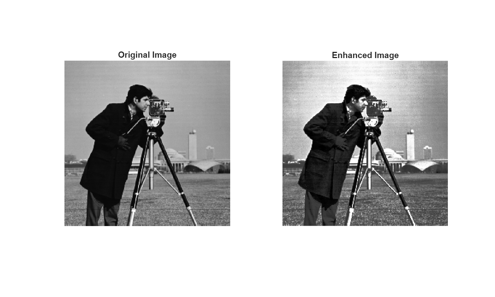

*Original vs Enhanced image*

**Histogram Comparison:**

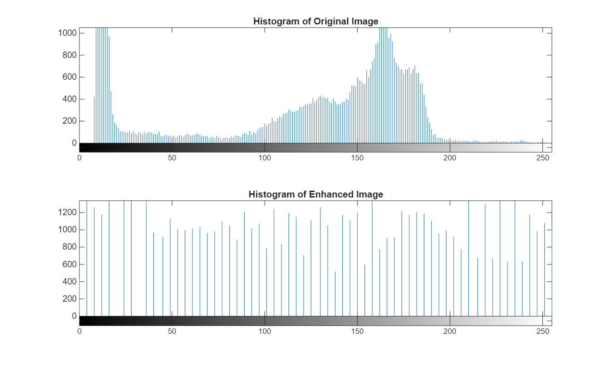

*Original histogram (concentrated) vs equalized histogram (spread out)*

**Transform Comparison:**

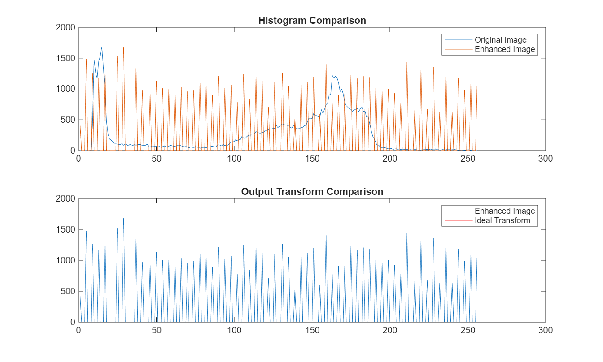

*Top: Histogram overlay of original and enhanced. Bottom: Enhanced image transform vs ideal linear transform (red)*

---

## 🔬 Script 5 — Image Synthesis & Intensity Analysis (Combined)
**File:** `image_synthesis_intensity_analysis.m`

A comprehensive script that combines image synthesis, brightness adjustment, and histogram equalization in a single workflow with three multi-panel figures.

**Operations:**
- Synthesizes a 3-band grayscale image (left third = red channel, middle = green, right = blue, then converted to gray)
- Applies brightness adjustment of ±100
- Applies histogram equalization
- Generates three full comparison figures

**Figure 1 — Original vs Synthesized:**

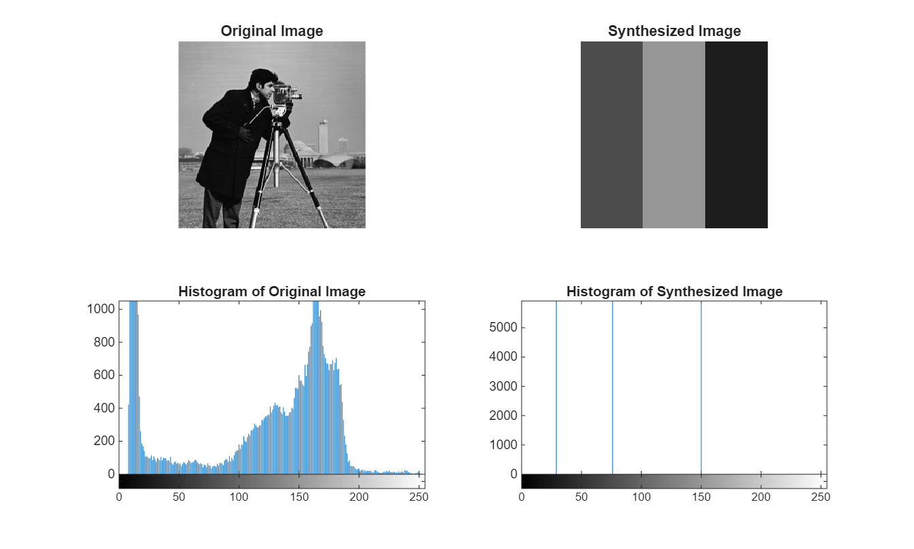

*Cameraman image alongside the synthesized 3-band grayscale image and their histograms*

**Synthesized Image:**

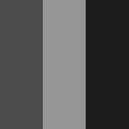

*The synthesized image showing 3 distinct intensity bands*

**Figure 2 — Brightness Adjustment (±100):**

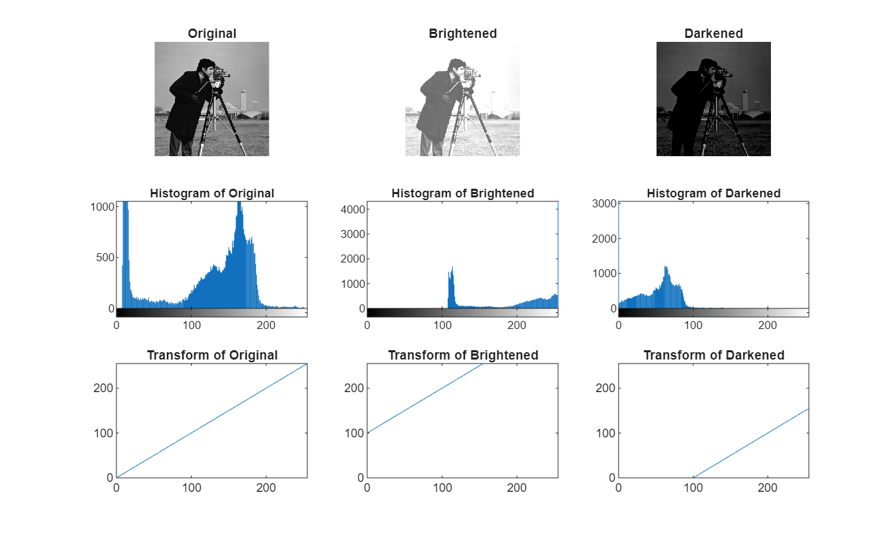

*3×3 grid: images, histograms, and output transforms for original, brightened (+100), and darkened (-100)*

**Brightened & Darkened Images:**

<div>
  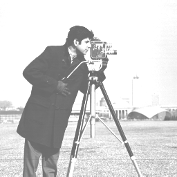
  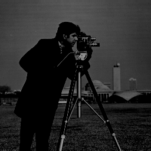
</div>

*Left: Brightened by 100 — Right: Darkened by 100*

**Figure 3 — Histogram Equalization:**

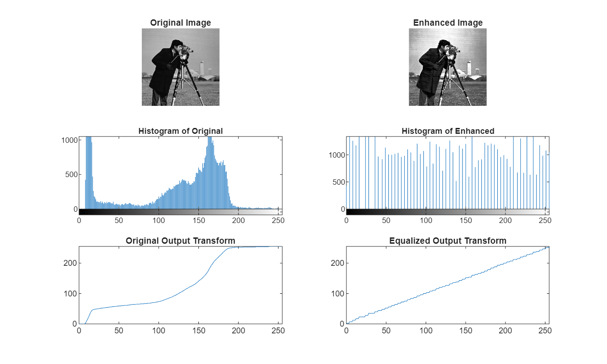

*Images, histograms, and output transforms before and after equalization*

**Equalized Image:**


*Equalized version of the cameraman image*

---

## 🚀 Getting Started

### Prerequisites

```
MATLAB R2018a or later
Image Processing Toolbox
```

### Usage

1. **Clone the repository**
```bash
git clone https://github.com/TendoPain18/image-processing-matlab.git
cd image-processing-matlab/Mat-Lab
```

2. **Open MATLAB and navigate to the project folder**
```matlab
cd 'path/to/Mat-Lab'
```

3. **Run any script**
```matlab
% Manual brightness adjustment
brightness_point_processing_manual

% Contrast stretching
contrast_stretching_intensity_adjustment

% Histogram equalization with CDF analysis
histogram_equalization_cdf_analysis

% Histogram equalization visualization
histogram_equalization_visualization

% Full combined analysis
image_synthesis_intensity_analysis
```

All output images are saved automatically to the `images/` folder.

## 🙏 Acknowledgments

- Course: Image Processing — Communications and Information Engineering
- MATLAB Image Processing Toolbox

<br>
<div align="center">
  <a href="https://codeload.github.com/TendoPain18/image-processing-matlab/legacy.zip/main">
    
  </a>
</div>

## <!-- CONTACT -->
<div id="toc" align="center">
  <ul style="list-style: none">
    <summary>
      <h2 align="center">
        🚀
        CONTACT ME
        🚀
      </h2>
    </summary>
  </ul>
</div>
<table align="center" style="width: 100%; max-width: 600px;">
<tr>
  <td style="width: 20%; text-align: center;">
    <a href="https://www.linkedin.com/in/amr-ashraf-86457134a/" target="_blank">
      
    </a>
  </td>
  <td style="width: 20%; text-align: center;">
    <a href="https://github.com/TendoPain18" target="_blank">
      
    </a>
  </td>
  <td style="width: 20%; text-align: center;">
    <a href="mailto:amrgadalla01@gmail.com">
      
    </a>
  </td>
  <td style="width: 20%; text-align: center;">
    <a href="https://www.facebook.com/amr.ashraf.7311/" target="_blank">
      
    </a>
  </td>
  <td style="width: 20%; text-align: center;">
    <a href="https://wa.me/201019702121" target="_blank">
      
    </a>
  </td>
</tr>
</table>
<!-- END CONTACT -->
